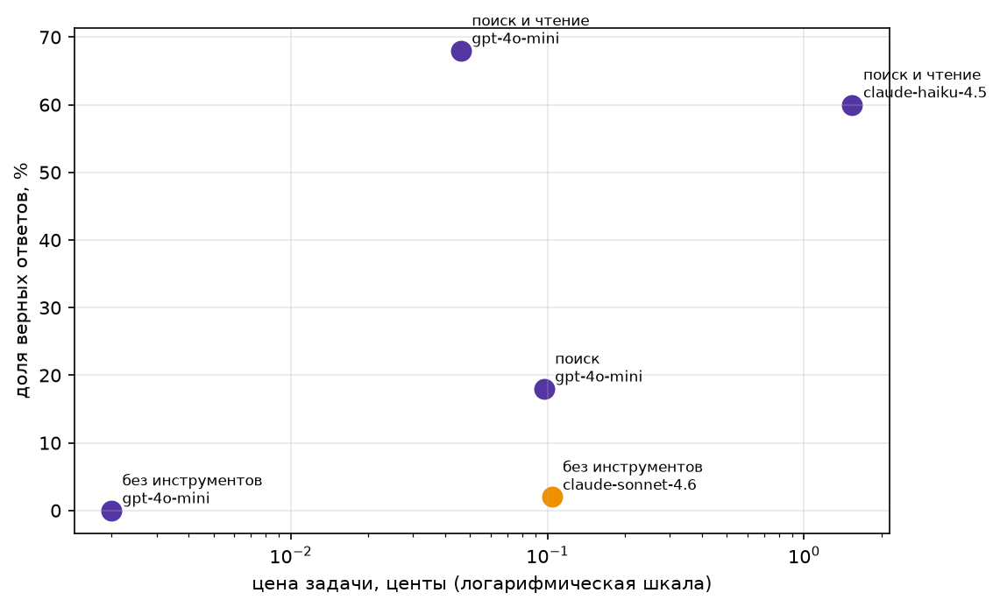

# Домашнее задание 1. Свежие вопросы и агент, который на них отвечает

# Запуск репозитория

```bash
python -m venv .venv && source .venv/bin/activate
pip install -r requirements.txt
cp .env.example .env          # вписать свой OPENROUTER_API_KEY

python check_fresh.py data/fresh.jsonl            # проверка формата, ключ не нужен
python check_fresh.py data/fresh.jsonl --sonnet   # проверка свежести, нужен ключ
jupyter notebook ai-agent-01.ipynb                # агент и замер
```

## Датасет

**Тема:** события только 2026 года. Тема набора: США, Великобритания, Япония, Индия, Канада, Мексика, Бразилия,
Франция, Испания, Южная Корея и другие (Источник: Википедия).

**Как собирал.** Вариант 1 из задания: расширил стартовый набор своими вопросами.

- Стартовые 125 вопросов (`fresh_2026.jsonl`);
- 23 добавлены скриптом `fetch_fresh.py` с сидами 42 и 99. Скрипт режет статьи на факты
  с датами, дешёвая модель делает из каждого факта вопрос с коротким ответом, дальше остаются
  только те, на которые Sonnet без инструментов ответил неверно
- После автосбора прошёл по новым записям руками и выкинул пять штук, не проходящих требования:
  - запланированное событие (дата финала Лиги чемпионов) — условие требует только случившееся;
  - три непонятных вопроса, непонятно о каком событии шла речь;
  - вопрос про возраст человека и вопрос про накопительную статистику клуба за всю историю;
  — события не 2026 года
- Итого **148 вопросов**, все с полями `question`, `answer`, `evidence`, `url`

Файл: `data/fresh.jsonl`

## Проверка свежести

```
$ python check_fresh.py data/fresh.jsonl --sonnet
записей: 148, проблем: 0

Sonnet без инструментов: 1 из 148 верно, 1%. Потрачено $0.244
критерий свежести пройден
  fresh-43: Who was sworn in as the Mayor of New York City on January 1, 2026? -> Zohran Mamdani was sworn in as the Mayor
```

**1% при допустимых 20%.** Единственный угаданный вопрос — про вступление мэра Нью-Йорка
в должность 1 января 2026. Пограничный случай: выборы прошли в конце 2025 и попали в обучающие
данные скорее всего, а инаугурация уже была за отсечкой.

## Замер

60 вопросов из 148.

| Конфигурация | Модель | n | Доля верных | Цена задачи | Цена верного ответа | Шагов | Секунд |
| --- | --- | --- | --- | --- | --- | --- | --- |
| без инструментов | claude-sonnet-4.6 | 60 | 0.02 | 0.00104 | 0.06219 | 1.00 | 2.2 |
| без инструментов | gpt-4o-mini | 60 | 0.00 | 0.00002 | inf | 1.00 | 1.6 |
| поиск | gpt-4o-mini | 60 | 0.18 | 0.00097 | 0.00528 | 6.87 | 32.2 |
| поиск и чтение | gpt-4o-mini | 60 | **0.68** | **0.00046** | **0.00067** | 3.87 | 14.5 |
| поиск и чтение | claude-haiku-4.5 | 60 | 0.60 | 0.01541 | 0.02568 | 4.72 | 21.0 |

Сырые данные по каждой задаче — `results_v1.csv`, таблица — `results.md`, трейсы — `traces/`.



## Два разобранных провала

**1. Поиск нашёл не то.** [`traces/поиск и чтение/gpt-4o-mini/fresh-2.json`](traces/поиск%20и%20чтение/gpt-4o-mini/fresh-2.json)

Вопрос: «Who entered negotiations with the Trump administration on March 13, 2026?», эталон
«Miguel Díaz-Canel». Агент запросил `web_search("negotiations Trump administration March 13 2026")`,
первым результатом получил статью про переговоры Ирана и США, увидел в ней Трампа и переговоры
и ответил «Iran» на втором шаге. Дату он не сверил, а `page_find` не вызвал вообще —
удовлетворился вступлением первой найденной статьи.

**2. Ответ верный, но не прошёл проверку.** [`traces/поиск и чтение/gpt-4o-mini/fresh-1.json`](traces/поиск%20и%20чтение/gpt-4o-mini/fresh-1.json)

Агент нашёл правильную дату и написал её как «22 марта 2026» при эталоне «22 March».
Факт верный, язык другой. `is_correct` требует дословного вхождения нормализованного эталона
в ответ — и засчитывает это как ошибку.

Это не единичный случай. Из 19 провалов лучшей конфигурации как минимум пять — того же рода:
«March 15, 2026» против «15 March», «2» против «two people», «9» против «nine» дважды.
То есть **реальная доля верных ответов выше измеренных 68 процентов**; строгая проверка
съедает около 8% пунктов. `is_correct` оставлен семинарским намеренно, чтобы
цифры были сопоставимы с базовой линией, но при доработке стоило бы нормализовать
числительные-словами и форматы дат.

## Вывод

**Гипотеза подтвердилась.** Sonnet без инструментов — 2%, дешёвая модель с поиском и чтением - 68%.
Цена задачи вдвое ниже (0.00046 против 0.00104), цена верного ответа ~ в 93 раза
(0.00067 против 0.06219).

**Инструменты дают профит.** `page_find` поднял долю верных с 18% до 68% на той же
модели. Переход на модель в 30 раз дороже не дал ничего: Haiku 60% против 68% у mini.

**Лишний инструмент удешевил работу.** «Только поиск» — 0.00097 за задачу, «поиск и чтение» -
0.00046. Причина в шагах: 6.87 против 3.87. Без `page_find` агент не находит факт во вступлении,
переформулирует запрос и упирается в лимит шагов.

**Где не работает.** На вопросах из обучающих данных инструменты только добавляют шаги, задержку
и цену. Выигрыш здесь держится на том, что набор собран из того, чего модель не знает.

## Структура репозитория

```
data/fresh.jsonl        итоговый набор, 148 вопросов
fetch_fresh.py          сбор вопросов из Википедии
check_fresh.py          проверка формата и свежести
ai-agent-01.ipynb       агент, инструменты, тесты, замер
freshness_check.txt     вывод проверки свежести
traces/                 трейсы прогонов по конфигурациям
img/homework.png        цена против качества
results.md              итоговая таблица
results_v1.csv          сырые результаты по каждой задаче
```
